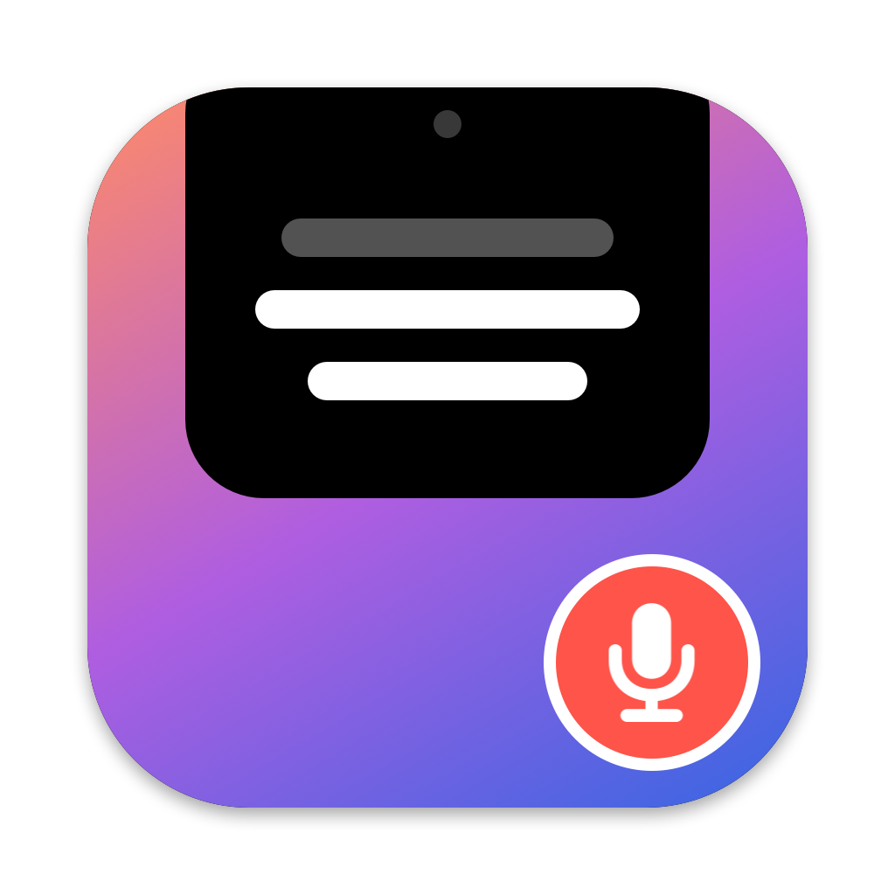
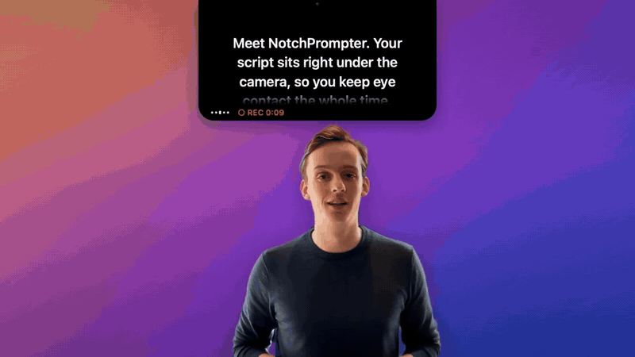
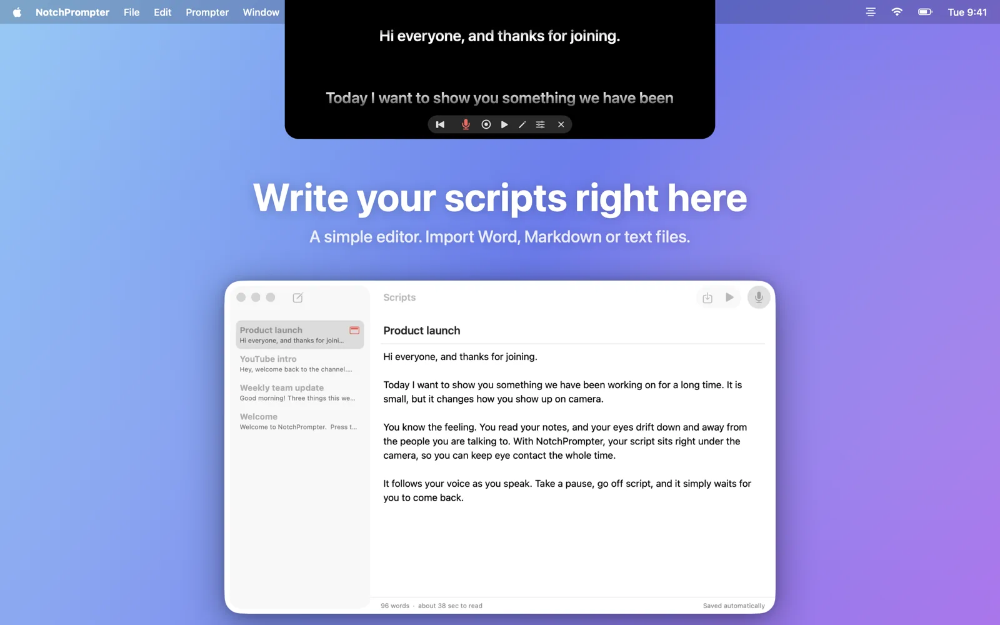
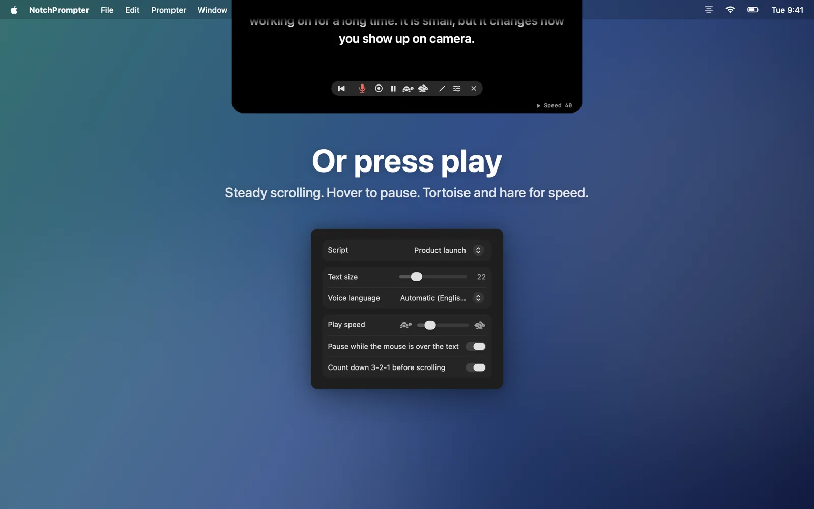

<div align="center">
  
  <h1>NotchPrompter</h1>
  <p><b>A free teleprompter for the Mac that sits right under your camera and follows your voice.</b><br>
  Read your script and keep eye contact.</p>

  <a href="https://apps.apple.com/app/notchprompter/id6815206814"></a>
  <a href="https://magnram.github.io/notchprompter/"></a>
  <br>
  
  
  
  <a href="LICENSE"></a>
</div>

<br>

<p align="center">
  <a href="https://magnram.github.io/notchprompter/media/promo.mp4"></a>
  <br>
  <sub><a href="https://magnram.github.io/notchprompter/media/promo.mp4">▶ Watch the full video with sound (51 s)</a></sub>
</p>

When you read from notes, your eyes drift down, away from the people you talk to.
NotchPrompter puts your script in a small black panel that hangs from the top of your screen,
right under the camera. On a MacBook with a notch, it blends into the notch.
Press the microphone and talk: the text follows you, so the next words are always where you look.

## Features

- 🎙️ **Follows your voice.** The text moves as you read. Words you have said fade out.
- 🌍 **Any language.** It sees which language your script is in and listens for it.
- ⏭️ **Keeps up when you go off script.** Skip a sentence and it finds your place. Say "uh", or a sentence again, and it stays put. Pause, and it waits.
- ▶️ **Or press play.** Smooth scrolling with a 3-2-1 countdown and speed controls.
- ✍️ **Built-in script editor.** Import Word, Markdown, RTF, HTML or text. Notes in (parentheses) or [brackets] are shown, but not read out.
- 🎬 **Record yourself.** Film your camera, your screen, or both, while the script follows your voice. A small preview shows how you look. Takes go to Movies › NotchPrompter.
- 🙈 **Invisible to your audience.** Hidden from screen sharing, screenshots and recordings.
- 🔒 **Runs on your Mac.** Speech is recognised on the Mac. No account, no tracking. The microphone and camera are only on while you use them.

<table>
  <tr>
    <td width="50%"></td>
    <td width="50%"></td>
  </tr>
  <tr>
    <td align="center"><sub>Write or import your script</sub></td>
    <td align="center"><sub>Or scroll at a steady pace</sub></td>
  </tr>
</table>

## Get started

1. Get NotchPrompter from the [Mac App Store](https://apps.apple.com/app/notchprompter/id6815206814), or [build it yourself](#build-from-source).
2. Open it and allow the microphone and speech recognition. The welcome guide shows you how.
3. Click **Try It Now** and read the practice script out loud.

NotchPrompter needs macOS 15 Sequoia or later. It works best on a MacBook with a notch,
and on any Mac with a camera on top of the screen.

## On iPhone

There is also **NotchPrompter for iPhone**. It puts your script right under the front camera,
follows your voice and films you, and every take goes to your Photos.

It is free to try: Scroll mode, the editor and the practice script are free, and you get 3 free takes
with voice-follow and recording. After that, a one-time purchase unlocks everything
(49 kr in Norway, or the same in your currency). No subscription.

The iPhone app is **not open source**. It uses the same voice engine as the Mac app,
[NotchPrompterKit](NotchPrompterKit), which is in this repository under the MIT license.
It is coming soon to the App Store.

## Keyboard shortcuts

When the prompter has focus (click it first):

| Key | Action |
|---|---|
| <kbd>V</kbd> | Follow my voice, on or off |
| <kbd>Space</kbd> | Play or pause |
| <kbd>C</kbd> | Record, or stop recording |
| <kbd>R</kbd> | Back to the top |
| <kbd>E</kbd> | Open the script editor |
| <kbd>↑</kbd> <kbd>↓</kbd> | Faster, slower |
| <kbd>⌘</kbd> <kbd>+</kbd> / <kbd>⌘</kbd> <kbd>−</kbd> | Bigger, smaller text |
| <kbd>←</kbd> <kbd>→</kbd> | Narrower, wider prompter |
| <kbd>⇧</kbd> <kbd>↑</kbd> <kbd>↓</kbd> | Shorter, taller prompter |
| <kbd>H</kbd> | Pause when the mouse is over the prompter, on or off |
| <kbd>Esc</kbd> | Stop |

In the Prompter menu: <kbd>⇧</kbd><kbd>⌘</kbd><kbd>P</kbd> shows the prompter, <kbd>⇧</kbd><kbd>⌘</kbd><kbd>V</kbd> follows your voice
and <kbd>⌥</kbd><kbd>⌘</kbd><kbd>R</kbd> records. Click a word in the prompter to continue from there.

## Privacy

- Speech recognition runs on your Mac. It needs Dictation turned on in System Settings.
  You can allow Apple's servers in Settings → Privacy for languages the Mac can't do by itself.
- Scripts and recordings stay on your Mac. There is no account, no analytics and no network code of our own.
- The prompter is hidden from screen sharing, screenshots and screen recordings. You can turn this off in Settings → Privacy.

## FAQ

<details>
<summary><b>Do I need a MacBook with a notch?</b></summary>
<br>
No. On a Mac without a notch, the prompter hangs from the top of the screen, under the camera, in the same way.
</details>

<details>
<summary><b>Which languages does voice-follow understand?</b></summary>
<br>
Every language that Apple's speech recognition supports on your Mac: English, Norwegian, German, Spanish,
Japanese and dozens more. NotchPrompter picks the language from your script. You can also choose it in Settings.
</details>

<details>
<summary><b>Why can't the people in my call see the prompter?</b></summary>
<br>
That's on purpose: the prompter window is left out of screen sharing, screenshots and recordings.
Turn it off in Settings → Privacy if you want to show it.
</details>

<details>
<summary><b>The text doesn't move when I talk.</b></summary>
<br>
Check that NotchPrompter can use the microphone and speech recognition in System Settings → Privacy &amp; Security,
and that Dictation is on (System Settings → Keyboard). The microphone button in the prompter must be on.
</details>

<details>
<summary><b>How does voice-follow work?</b></summary>
<br>
Apple's speech recogniser streams the words it hears. <code>VoiceMatcher</code> (in
<a href="NotchPrompterKit/Sources/NotchPrompterKit/VoiceMatcher.swift"><code>VoiceMatcher.swift</code></a>) lines up the last few heard words with the script.
A word or two ahead is easy to reach. A bigger jump needs several words in a row that fit, and words that come up
all over the script count less than rare ones. It never jumps back on its own, and it stays put when you say
a part again. The tests are in <code>Tools/MatcherTests</code> (run <code>Tools/test-matcher.sh</code>).
</details>

## Build from source

Open `NotchPrompter.xcodeproj` in Xcode 16 or later and run, or from the terminal:

```sh
./build.sh && open NotchPrompter.app
```

To sign with your own team, change `DEVELOPMENT_TEAM` in the project settings.

## Translations

The app, the website and the App Store page are in 20 languages: English, Norwegian, German, French, Spanish,
Italian, Portuguese (Brazil and Portugal), Dutch, Swedish, Danish, Finnish, Polish, Japanese, Korean,
Chinese (Simplified and Traditional), Russian, Ukrainian and Turkish.

Native speakers have not checked the translations yet. If a word is wrong in your language, please
[open an issue](https://github.com/magnram/notchprompter/issues) or send a pull request.

| What | Where | How to update |
|---|---|---|
| App text | `NotchPrompter/Localizable.xcstrings`, `InfoPlist.xcstrings`, and the voice engine's messages in `NotchPrompterKit/Sources/NotchPrompterKit/Localizable.xcstrings` | Edit in Xcode's string catalog editor |
| Website | `website/i18n/<lang>.json` | Run `python3 website/i18n/build.py`, then commit the pages it writes. See [website/i18n/README.md](website/i18n/README.md) |
| App Store text | `fastlane/metadata/<locale>/` | Check the length limits with `python3 fastlane/check_metadata.py` |
| Screenshots | `NotchPrompter/ScreenshotContent.swift` | Run `Tools/render-all-languages.sh` (or give it languages, e.g. `de ja`) |

<details>
<summary><b>Release and project layout</b> (for maintainers)</summary>

### Release

The App Store release uses [fastlane](https://fastlane.tools) with an App Store Connect API key
(`ASC_KEY_ID`, `ASC_ISSUER_ID` and `ASC_KEY_PATH` in the environment).

```sh
fastlane mac status                   # show the versions and builds; changes nothing
fastlane mac release version:1.1      # build, upload the package, text and screenshots
fastlane mac metadata version:1.1     # only the text and screenshots
fastlane mac submit_review            # submit for review, with manual release
```

The version is required, so text for a new version never lands in one that is already in review.

### Project layout

| Folder | What's in it |
|---|---|
| `NotchPrompter/` | The app (AppKit + SwiftUI) |
| `NotchPrompterKit/` | Swift package for macOS and iOS: the voice engine (`VoiceMatcher`, `VoiceListener`), stage directions, script storage and settings. The Mac app and the iPhone app both use it |
| `Config/` | Entitlements and Info.plist |
| `Tools/` | Icon generator, screenshot rendering and matcher tests (`Tools/test-matcher.sh`) |
| `website/` | The website, published to GitHub Pages by `.github/workflows/pages.yml` |
| `AppStore/` | App Store listing notes, English screenshots and the submission checklist |
| `fastlane/` | Release lanes, and the App Store text and screenshots for every language |
| `video/` | The promo videos (landscape and TikTok), made with HyperFrames |

</details>

## Contributing

Bug reports and ideas are welcome in [Issues](https://github.com/magnram/notchprompter/issues). Pull requests too.

## License

[MIT](LICENSE)
