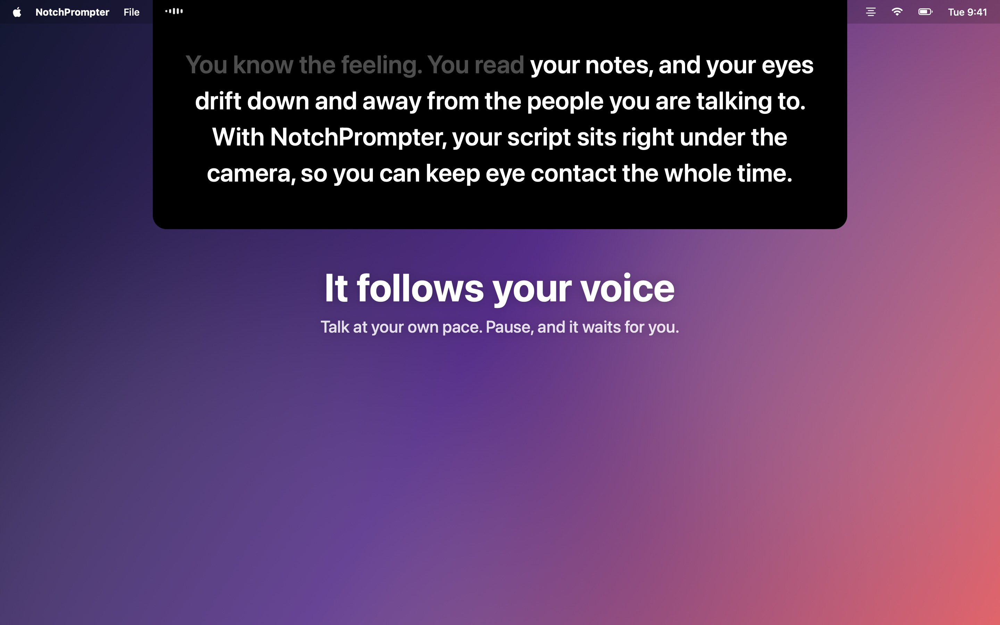

<p align="center"></p>

# NotchPrompter

A free, open-source teleprompter for the Mac that hangs right under your camera and follows your voice.
Read your script and keep eye contact.

**Website:** https://magnram.github.io/notchprompter/
**Mac App Store:** https://apps.apple.com/app/id6815206814



## Features

- **Follows your voice.** Press the microphone and talk. The text moves as you read, so the next words are always under the camera.
- **Any language.** It sees which language your script is in and listens for it.
- **Keeps up when you skip.** Skip a sentence or say "uh", and it finds your place. Pause, and it waits.
- **Or press play.** Smooth scrolling with a 3-2-1 countdown and speed controls.
- **Built-in script editor.** Import Word, Markdown, RTF, HTML or text. Notes in (parentheses) or [brackets] are shown but not read out.
- **Record yourself.** Film your camera and microphone while you read, and optionally the screen too. Takes go to Movies › NotchPrompter.
- **Invisible to your audience.** Hidden from screen sharing, screenshots and recordings.
- **Runs completely on your Mac.** Speech is recognised on-device (with Dictation turned on). No account, no tracking.
- **In 20 languages.** The app, the website and the App Store listing.

## Requirements

macOS 15 Sequoia or later. Works best on a MacBook with a notch.

## Build

Open `NotchPrompter.xcodeproj` in Xcode 16 or later and run, or from the terminal:

```sh
./build.sh && open NotchPrompter.app
```

To sign with your own team, change `DEVELOPMENT_TEAM` in the project settings.

## Languages

English, Norwegian, German, French, Spanish, Italian, Portuguese (Brazil and Portugal), Dutch, Swedish,
Danish, Finnish, Polish, Japanese, Korean, Chinese (Simplified and Traditional), Russian, Ukrainian and Turkish.

Voice-follow works in many more languages: every language that Apple's speech recognition supports.

Native speakers have not checked the translations yet. If a word is wrong in your language, please
[open an issue](https://github.com/magnram/notchprompter/issues) or send a pull request.

| What | Where | How to update |
|---|---|---|
| App text | `NotchPrompter/Localizable.xcstrings`, `InfoPlist.xcstrings` | Edit in Xcode's string catalog editor |
| Website | `website/i18n/<lang>.json` | Run `python3 website/i18n/build.py`, then commit the pages it writes. See [website/i18n/README.md](website/i18n/README.md) |
| App Store text | `fastlane/metadata/<locale>/` | Check the length limits with `python3 fastlane/check_metadata.py` |
| Screenshots | `NotchPrompter/ScreenshotContent.swift` | Run `Tools/render-all-languages.sh` (or give it languages, e.g. `de ja`) |

## Release

The App Store release uses [fastlane](https://fastlane.tools) with an App Store Connect API key
(`ASC_KEY_ID`, `ASC_ISSUER_ID` and `ASC_KEY_PATH` in the environment).

```sh
fastlane mac release version:1.1      # build, upload the package, text and screenshots
fastlane mac metadata version:1.1     # only the text and screenshots
fastlane mac submit_review            # submit for review, with manual release
```

The version is required, so text for a new version never lands in one that is already in review.

## Project layout

| Folder | What's in it |
|---|---|
| `NotchPrompter/` | The app (AppKit + SwiftUI) |
| `Config/` | Entitlements and Info.plist |
| `Tools/` | Icon generator, screenshot rendering and matcher tests (`Tools/test-matcher.sh`) |
| `website/` | The website, published to GitHub Pages by `.github/workflows/pages.yml` |
| `AppStore/` | App Store listing notes, English screenshots and the submission checklist |
| `fastlane/` | Release lanes, and the App Store text and screenshots for every language |
| `video/` | The promo videos (landscape and TikTok), made with HyperFrames |

## Contributing

Bug reports and ideas are welcome in [Issues](https://github.com/magnram/notchprompter/issues). Pull requests too.

## License

[MIT](LICENSE)
